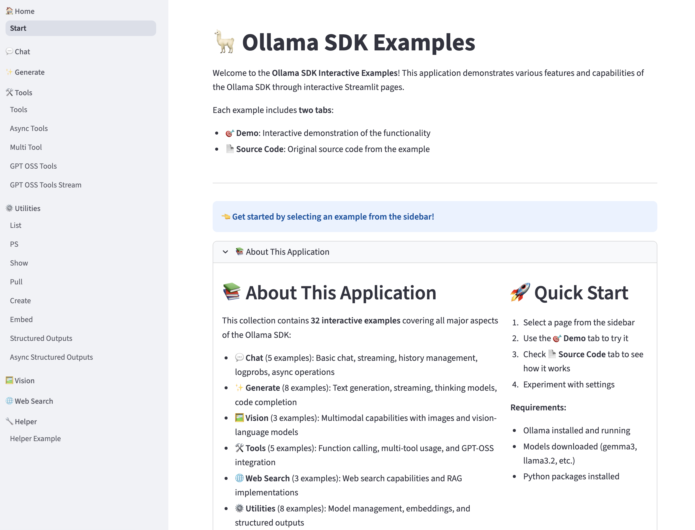

# Working with Streamlit and Ollama

This repository contains interactive Streamlit applications based on the official Ollama Python SDK examples. Each example has been adapted to provide a user-friendly web interface, making it easy to explore and experiment with Ollama's capabilities directly in your browser.



## Run Examples

Run the examples in this directory with:

```sh
# Run example
python3 examples/<example>.py

# or with uv
uv run examples/<example>.py
```

See [ollama/docs/api.md](src/https://github.com/ollama/ollama/blob/main/docs/api.md) for full API documentation


## 🚀 Quick Start Guide

### ✅ What's Been Created

**32 individual Streamlit pages** - each with:

- **🎯 Demo Tab**: Interactive functionality
- **📄 Source Code Tab**: Original implementation

### 📋 All Pages at a Glance

```text
💬 CHAT (01-05)
├── 01 💬 Chat
├── 02 💬 Chat Stream
├── 03 💬 Chat History
├── 04 💬 Chat Logprobs
└── 05 💬 Async Chat

✨ GENERATE (06-13)
├── 06 ✨ Generate
├── 07 ✨ Generate Stream
├── 08 ✨ Generate Logprobs
├── 09 ✨ Async Generate
├── 10 🧠 Thinking
├── 11 🧠 Thinking Generate
├── 12 🧠 Thinking Levels
└── 13 💻 Fill in Middle

🖼️ VISION (14-16)
├── 14 🖼️ Multimodal Chat
├── 15 🖼️ Multimodal Generate
└── 16 🖼️ Structured Outputs Image

🛠️ TOOLS (17-21)
├── 17 🛠️ Tools
├── 18 🛠️ Async Tools
├── 19 🛠️ Multi Tool
├── 20 🛠️ GPT-OSS Tools
└── 21 🛠️ GPT-OSS Tools Stream

🌐 WEB (22-24)
├── 22 🌐 Web Search
├── 23 🌐 Web Search GPT-OSS
└── 24 🌐 Web Search MCP

⚙️ UTILITIES (25-32)
├── 25 ⚙️ List
├── 26 ⚙️ PS
├── 27 ⚙️ Show
├── 28 ⚙️ Pull
├── 29 ⚙️ Create
├── 30 ⚙️ Embed
├── 31 ⚙️ Structured Outputs
└── 32 ⚙️ Async Structured Outputs
```

### 🏃 Run It Now

```bash
streamlit run app.py
```

Then open `http://localhost:8501` in your browser!

### 🎯 How to Use

1. **Select a page** from the sidebar (01-32)
2. **Click the 🎯 Demo tab** to try it interactively
3. **Click the 📄 Source Code tab** to see the implementation
4. **Adjust settings** in the sidebar (model, parameters)
5. **Experiment** and learn!

### 💡 Pro Tips

- Start with **01 Chat** for the basics
- Try **06 Generate** to understand text generation
- Check **14 Multimodal Chat** for vision capabilities
- Explore **17 Tools** for function calling
- Visit **25 List** to see available models

### 🎉 Enjoy

You now have 32 interactive examples to explore the Ollama SDK!

## Examples

### Chat - Chat with a model

- [chat.py](src/chat.py)
- [async-chat.py](src/async-chat.py)
- [chat-stream.py](src/chat-stream.py) - Streamed outputs
- [chat-with-history.py](src/chat-with-history.py) - Chat with model and maintain history of the conversation

### Generate - Generate text with a model

- [generate.py](src/generate.py)
- [async-generate.py](src/async-generate.py)
- [generate-stream.py](src/generate-stream.py) - Streamed outputs
- [fill-in-middle.py](src/fill-in-middle.py) - Given a prefix and suffix, fill in the middle

### Tools/Function Calling - Call a function with a model

- [tools.py](src/tools.py) - Simple example of Tools/Function Calling
- [async-tools.py](src/async-tools.py)
- [multi-tool.py](src/multi-tool.py) - Using multiple tools, with thinking enabled

### gpt-oss

- [gpt-oss-tools.py](src/gpt-oss-tools.py)
- [gpt-oss-tools-stream.py](src/gpt-oss-tools-stream.py)

### Web search

An API key from Ollama's cloud service is required. You can create one [here](src/https://ollama.com/settings/keys).

```shell
export OLLAMA_API_KEY="your_api_key_here"
```

- [web-search.py](src/web-search.py)
- [web-search-gpt-oss.py](src/web-search-gpt-oss.py) - Using browser research tools with gpt-oss

### MCP server

The MCP server can be used with an MCP client like Cursor, Cline, Codex, Open WebUI, Goose, and more.

```sh
uv run examples/web-search-mcp.py
```

Configuration to use with an MCP client:

```json
{
  "mcpServers": {
    "web_search": {
      "type": "stdio",
      "command": "uv",
      "args": ["run", "path/to/ollama-python/examples/web-search-mcp.py"],
      "env": { "OLLAMA_API_KEY": "your_api_key_here" }
    }
  }
}
```

- [web-search-mcp.py](src/web-search-mcp.py)

### Multimodal with Images - Chat with a multimodal (image chat) model

- [multimodal-chat.py](src/multimodal-chat.py)
- [multimodal-generate.py](src/multimodal-generate.py)

### Structured Outputs - Generate structured outputs with a model

- [structured-outputs.py](src/structured-outputs.py)
- [async-structured-outputs.py](src/async-structured-outputs.py)
- [structured-outputs-image.py](src/structured-outputs-image.py)

### Ollama List - List all downloaded models and their properties

- [list.py](src/list.py)

### Ollama Show - Display model properties and capabilities

- [show.py](src/show.py)

### Ollama ps - Show model status with CPU/GPU usage

- [ps.py](src/ps.py)

### Ollama Pull - Pull a model from Ollama

Requirement: `pip install tqdm`

- [pull.py](src/pull.py)

### Ollama Create - Create a model from a Modelfile

- [create.py](src/create.py)

### Ollama Embed - Generate embeddings with a model

- [embed.py](src/embed.py)

### Thinking - Enable thinking mode for a model

- [thinking.py](src/thinking.py)

### Thinking (generate) - Enable thinking mode for a model

- [thinking-generate.py](src/thinking-generate.py)

### Thinking (levels) - Choose the thinking level

- [thinking-levels.py](src/thinking-levels.py)
